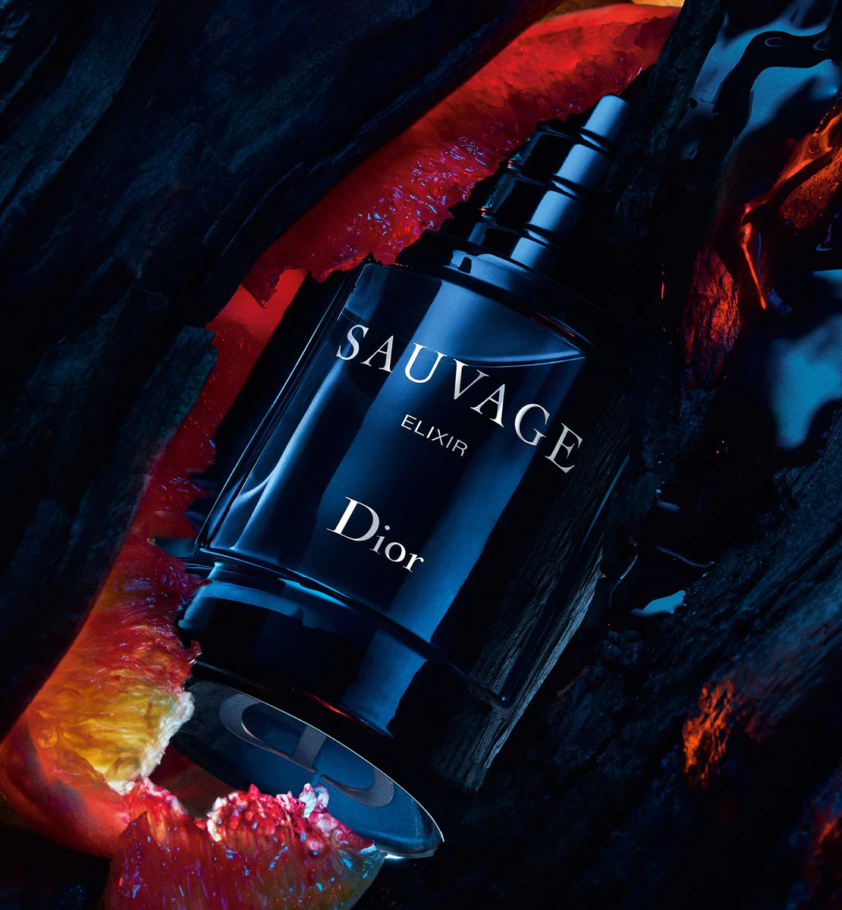
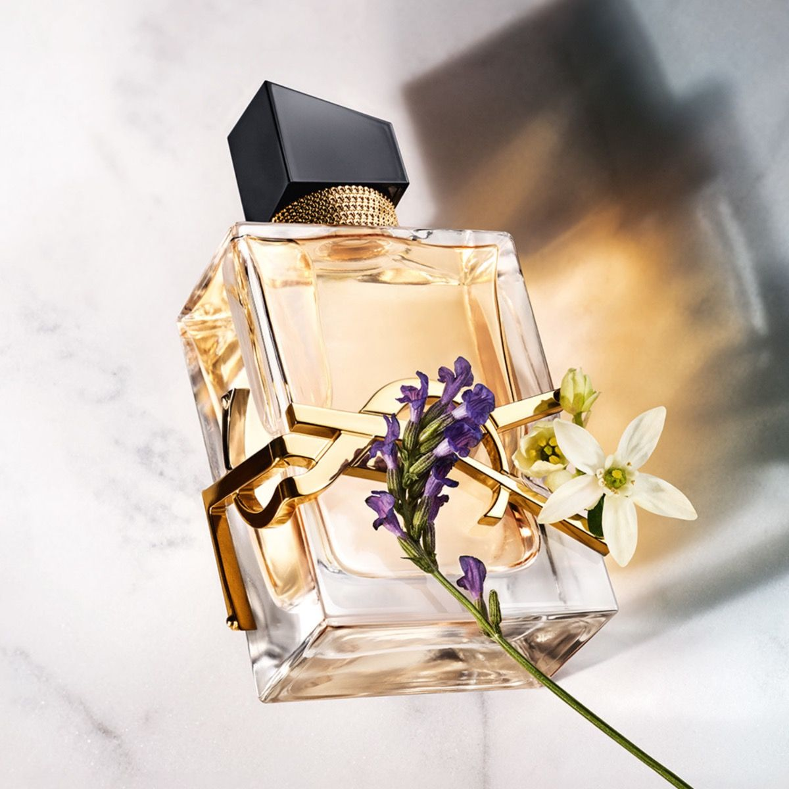
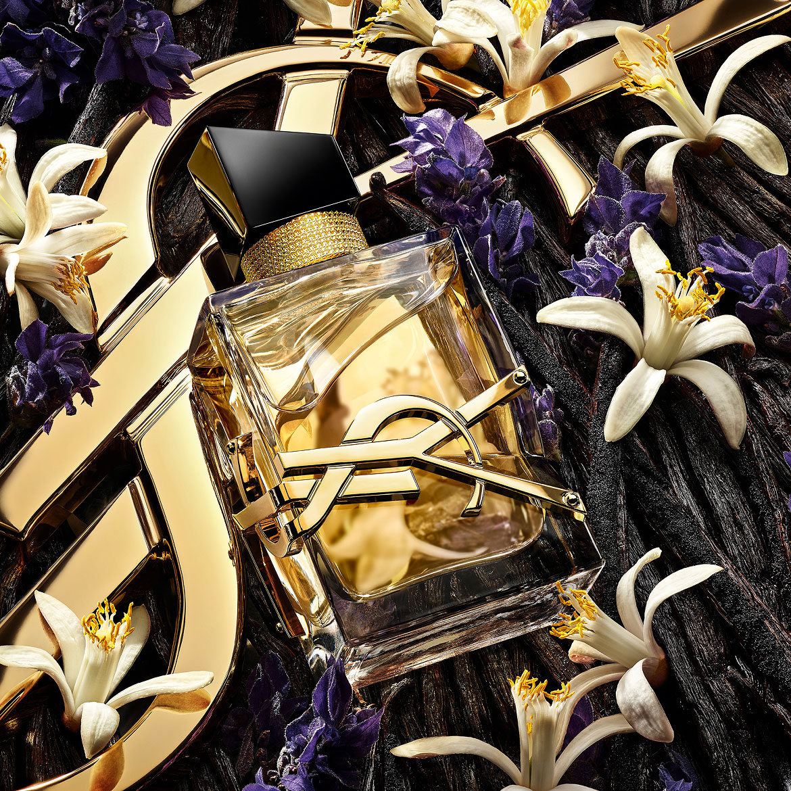

<html lang="fr">
<head>
    <meta charset="UTF-8">
    <meta name="viewport" content="width=device-width, initial-scale=1.0, maximum-scale=1.0, user-scalable=no">
    <title>Velooria Beauty | Collection Privée</title>
    <link href="https://fonts.googleapis.com/css2?family=Cinzel:wght@400;700&family=Montserrat:wght@200;400;600&display=swap" rel="stylesheet">
    
    
</head>
<body>

    
VELOORIA

    

    <section class="product-section sauv-t" id="sec1">
        
<video autoplay muted loop playsinline class="bg-v"><source src="assets/sauvage.mp4" type="video/mp4"></video>

        

            
            <h1 class="brand-logo">SAUVAGE</h1>
            
ELIXIR / EXTRAIT DE PARFUM

        

        

            

            

                <h3>La Fragrance</h3>
                
Sauvage Elixir est un parfum d'une concentration hors normes. Une essence nocturne capturant la puissance brute du désert, où la fraîcheur est poussée à l'extrême.

                
Pour : Lui | Il est : Puissant et Mystérieux Occasion : Soirée & Hiver

            

        

        

            

            

                <h3>Ingrédients & Notes</h3>
                
Notes de Tête : Cannelle & Cardamome (Impact immédiat) 
                Notes de Cœur : Essence de Lavande exclusive Dior 
                Notes de Fond : Réglisse & Bois de Santal (Sillage intense)

            

        

        

            

                

                    
<h4 style="color:#fff; font-family:'Cinzel'">DECANT 10ML</h4>
EXTRAIT DE PARFUM

                    
                

                

5ML

10ML

            

            

                <form><input type="text" placeholder="NOM"><input type="tel" placeholder="TÉLÉPHONE"><input type="text" placeholder="VILLE"><button class="order-btn">COMMANDER | 319 DH</button></form>
            

        

    </section>

    <section class="product-section stron-t" id="sec2">
        
<video autoplay muted loop playsinline class="bg-v"><source src="assets/stronger.mp4" type="video/mp4"></video>

        

            
            <h1 class="brand-logo">STRONGER WITH YOU</h1>
            
ABSOLUTELY / PARFUM INTENSE

        

        

            

            

                <h3>La Fragrance</h3>
                
Stronger With You Absolutely est le parfum le plus intense de la collection. Une signature masculine raffinée avec un nouvel accord rhum addictif.

                
Pour : Lui | Il est : Captivant et Sensuel Occasion : Rendez-vous galant

            

        

        

            

            

                <h3>Ingrédients & Notes</h3>
                
Notes de Tête : Accord Rhum & Bergamote 
                Notes de Cœur : Lavande & Davana 
                Notes de Fond : Vanille de Madagascar & Bois de Cèdre

            

        

        

            

                

                    
<h4 style="color:#fff; font-family:'Cinzel'">INTENSE 10ML</h4>
ABSOLUTE ELEGANCE

                    
                

                

5ML

10ML

            

            

                <form><input type="text" placeholder="NOM"><input type="tel" placeholder="TÉLÉPHONE"><input type="text" placeholder="VILLE"><button class="order-btn">COMMANDER | 319 DH</button></form>
            

        

    </section>

    <section class="product-section libre-t" id="sec3">
        
<video autoplay muted loop playsinline class="bg-v"><source src="assets/libre.mp4" type="video/mp4"></video>

        

            
            <h1 class="brand-logo">LIBRE</h1>
            
EAU DE PARFUM / INTENSE

        

        

            

            

                <h3>La Fragrance</h3>
                
Libre Intense est le parfum d'une femme libre qui vit selon ses propres règles. Une dualité florale entre la lavande de France et la fleur d'oranger du Maroc.

                
Pour : Elle | Elle est : Audacieuse et Royale Occasion : Luxe quotidien

            

        

        

            

            

                <h3>Ingrédients & Notes</h3>
                
Notes de Tête : Lavande, Mandarine & Bergamote 
                Notes de Cœur : Fleur d'Oranger & Jasmin Sambac 
                Notes de Fond : Vanille de Madagascar & Ambre Gris

            

        

        

            

                

                    
<h4 style="color:#fff; font-family:'Cinzel'">LIBRE 10ML</h4>
COUTURE FLOWERS

                    
                

                

5ML

10ML

            

            

                <form><input type="text" placeholder="NOM"><input type="tel" placeholder="TÉLÉPHONE"><input type="text" placeholder="VILLE"><button class="order-btn">COMMANDER | 319 DH</button></form>
            

        

    </section>

    <section class="product-section gg-t" id="sec4">
        
<video autoplay muted loop playsinline class="bg-v"><source src="assets/goodgirl.mp4" type="video/mp4"></video>

        

            
            <h1 class="brand-logo">GOOD GIRL</h1>
            
EAU DE PARFUM / INTENSE

        

        

            

            

                <h3>La fragrance</h3>
                
La douceur et le pouvoir de séduction du jasmin renforcent encore l’éclat de Good Girl. Le côté mystérieux est révélé grâce au cacao riche et à l’enivrante fève tonka.

                
Pour : Elle | Elle est : Séductrice et Puissante Occasion : Le jour et la nuit

            

        

        

            

            

                <h3>Ingrédients & Notes</h3>
                <ul>
                    <li>Notes de Tête : Amande (Impression 5-15 min)</li>
                    <li>Notes de Cœur : Jasmin & Tubéreuse (Dure 20-60 min)</li>
                    <li>Notes de Fond : Fève Tonka & Cacao (Reste jusqu'à 6h)</li>
                </ul>
                
Famille olfactive : AMBRÉE Florale

            

        

        

            

                

                    
<h4 style="color:#fff; font-family:'Cinzel'">GOOD GIRL 10ML</h4>
POWERFUL SEDUCTION

                    
                

                

5ML

10ML

            

            

                <form><input type="text" placeholder="NOM"><input type="tel" placeholder="TÉLÉPHONE"><input type="text" placeholder="VILLE"><button class="order-btn">COMMANDER | 319 DH</button></form>
            

        

    </section>

    
</body>
</html>
