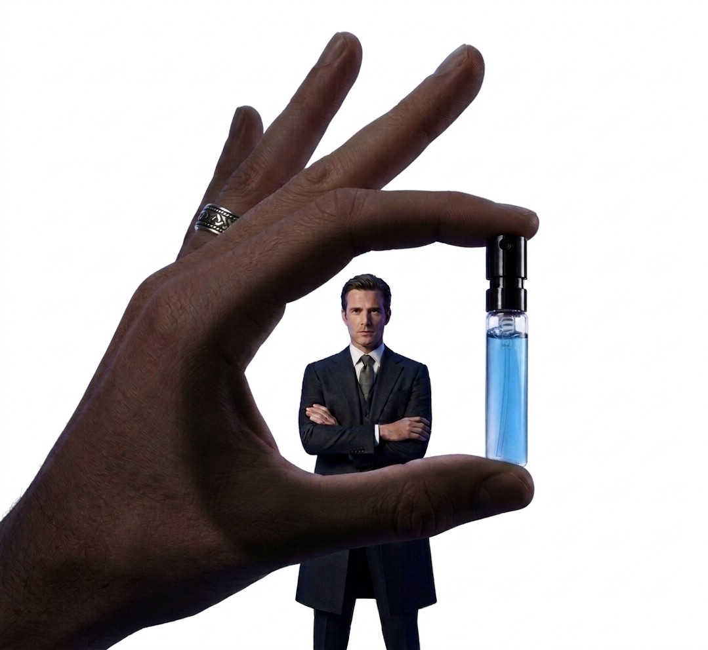
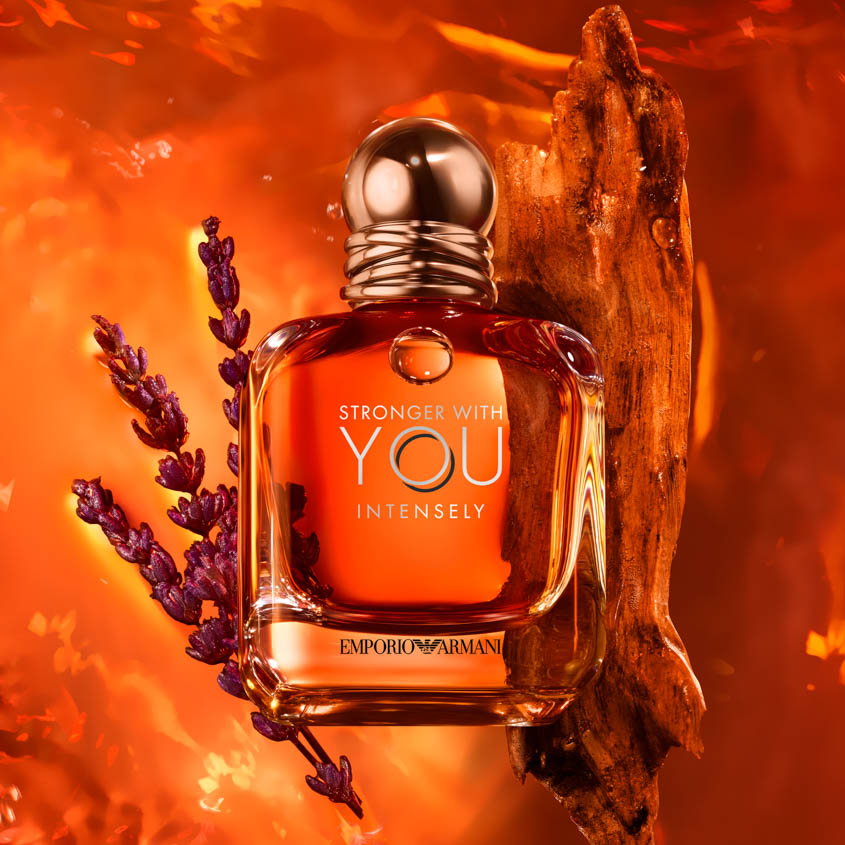
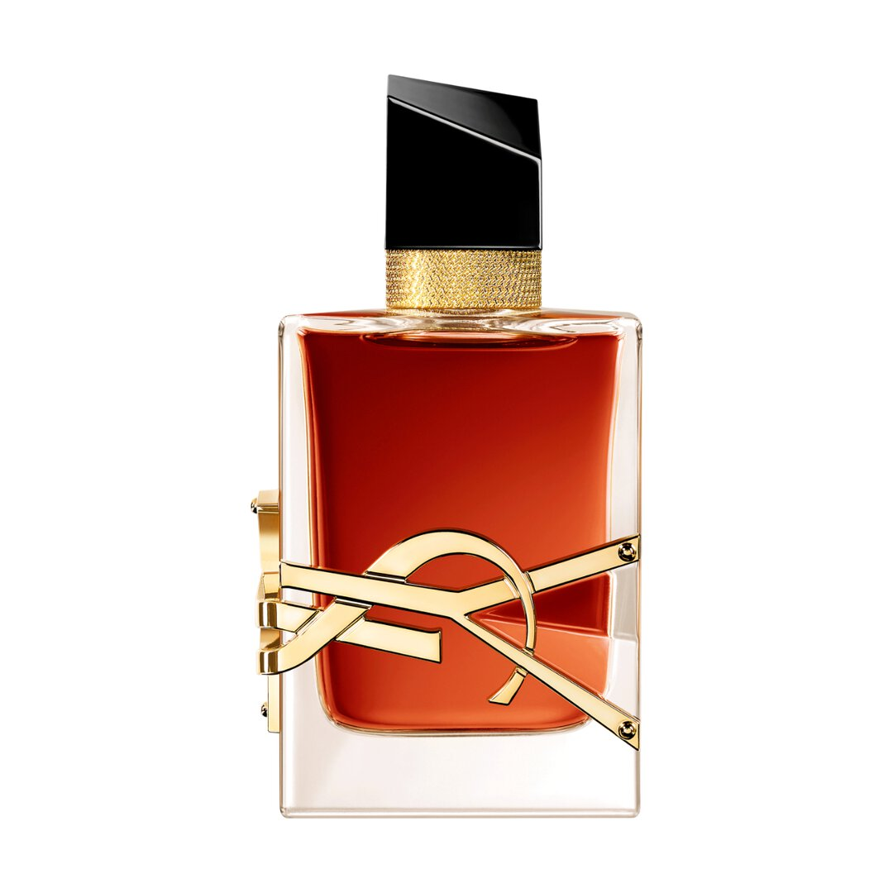
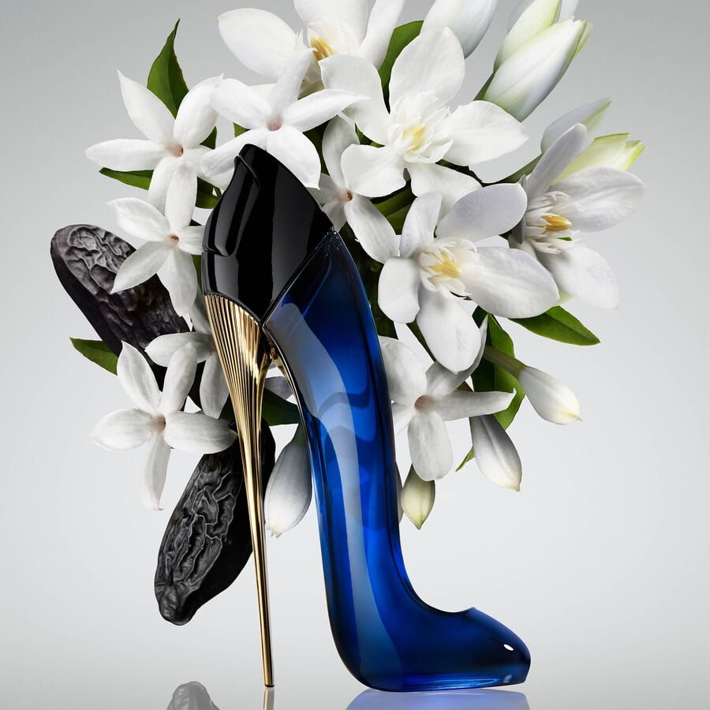
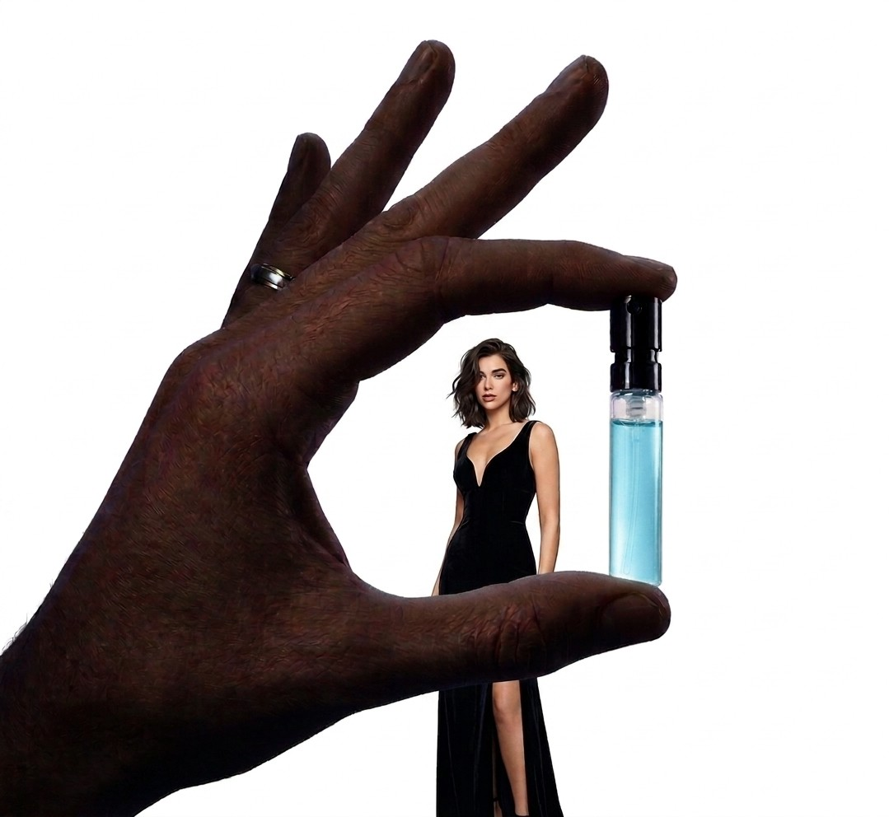

<html lang="en">

<head>

    <meta charset="UTF-8">

    <meta name="viewport" content="width=device-width, initial-scale=1.0, maximum-scale=1.0, user-scalable=no">

    <title>Velooria Beauty | Official Luxury Collection</title>

    <link href="https://fonts.googleapis.com/css2?family=Cinzel:wght@400;700&family=Montserrat:wght@200;400;600&display=swap" rel="stylesheet">

    

    

</head>

<body>

    
VELOORIA

    

    <section class="product-section sauv-t" id="sec1">

        

        
<video autoplay muted loop playsinline class="bg-v"><source src="assets/sauvage.mp4" type="video/mp4"></video>

        

            

            <h1 class="brand-logo">SAUVAGE ELIXIR</h1>

            
EXTRAIT DE PARFUM

        

        

            

            

                <h3>THE LEGENDARY DEPTH</h3>

                
Sauvage Elixir is an extraordinary concentration, a masterpiece of wild freshness. It intoxicates the senses with a custom-made heart of spices and a rich, woody trail that lingers long after you leave the room.

            

        

        

            

            

                <h3>OFFICIAL COMPOSITION</h3>

                
Notes: A powerful blend of Nutmeg, Cinnamon, and Cardamom, balanced perfectly by the freshness of Grapefruit and the warmth of Licorice.

            

        

        

            

                

                    
<h4 style="font-family:'Cinzel'">SAUVAGE ELIXIR</h4>
10ML / 319 DH

                    

                

                

                    
5ML± 80 SPRAYS

                    
10ML± 160 SPRAYS

                

            

            
<form><input name="name" placeholder="FULL NAME"><input name="phone" placeholder="PHONE NUMBER"><input name="city" placeholder="CITY"><button type="button" class="order-btn" onclick="sendOrder('sec1', 'SAUVAGE ELIXIR')">ORDER NOW | 319 DH</button></form>

        

    </section>

    <section class="product-section stron-t" id="sec2">

        

        
<video autoplay muted loop playsinline class="bg-v"><source src="assets/stronger.mp4" type="video/mp4"></video>

        

            

            <h1 class="brand-logo">STRONGER WITH YOU</h1>

            
EAU DE PARFUM

        

        

            

            

                <h3>MAGNETIC SENSUALITY</h3>

                
Stronger With You lives in the present, molded by the energy of modernity. Unpredictable, it surprises with its originality, like the spicy accord in the top notes—a mix of cardamom, pink peppercorn, and violet leaves.

            

        

        

            

            

                <h3>OLFACTORY ARCHITECTURE</h3>

                
Heart: The aromatic heart consists of Sage and Lavender, bringing a confident elegance with the easy insouciance of youth, followed by a base of smoky Vanilla Jungle Essence.

            

        

        

            

                

                    
<h4 style="font-family:'Cinzel'">STRONGER WITH YOU</h4>
10ML / 319 DH

                    

                

                

                    
5ML± 80 SPRAYS

                    
10ML± 160 SPRAYS

                

            

            
<form><input name="name" placeholder="FULL NAME"><input name="phone" placeholder="PHONE NUMBER"><input name="city" placeholder="CITY"><button type="button" class="order-btn" onclick="sendOrder('sec2', 'STRONGER WITH YOU')">ORDER NOW | 319 DH</button></form>

        

    </section>

    <section class="product-section libre-t" id="sec3">

        

        
<video autoplay muted loop playsinline class="bg-v"><source src="assets/libre.mp4" type="video/mp4"></video>

        

            

            <h1 class="brand-logo">LIBRE INTENSE</h1>

            
EAU DE PARFUM INTENSE

        

        

            

            

                <h3>BORN TO BE WILD</h3>

                
The iconic structure of Libre, intensified. A burning floral duality, where the tension between French lavender and Moroccan orange blossom becomes even more excessive, enveloped in a creamy orchid accord.

            

        

        

            

            

                <h3>THE RAW ELEMENTS</h3>

                
Base: Madagascar Vanilla and Tonka Bean provide a dark, smoky depth that contrasts beautifully with the bright citrus top notes, creating a trail that is both fierce and feminine.

            

        

        

            

                

                    
<h4 style="font-family:'Cinzel'">LIBRE INTENSE</h4>
10ML / 319 DH

                    

                

                

                    
5ML± 80 SPRAYS

                    
10ML± 160 SPRAYS

                

            

            
<form><input name="name" placeholder="FULL NAME"><input name="phone" placeholder="PHONE NUMBER"><input name="city" placeholder="CITY"><button type="button" class="order-btn" onclick="sendOrder('sec3', 'LIBRE INTENSE')">ORDER NOW | 319 DH</button></form>

        

    </section>

    <section class="product-section gg-t" id="sec4">

        

        
<video autoplay muted loop playsinline class="bg-v"><source src="assets/goodgirl.mp4" type="video/mp4"></video>

        

            

            <h1 class="brand-logo">GOOD GIRL</h1>

            
EAU DE PARFUM

        

        

            

            

                <h3>IT'S SO GOOD TO BE BAD</h3>

                
Inspired by the duality of the modern woman: audacious and sexy, elegant and enigmatic. Good Girl represents the complex vibrant world of femininity through a bold mix of dark and light elements.

            

        

        

            

            

                <h3>OLFACTORY NOTES</h3>

                
Heart: The sweet qualities of Jasmine and Tuberose give the fragrance its brightness, while Roasted Tonka Bean and Cocoa provide the mysterious dark side that lasts all night.

            

        

        

            

                

                    
<h4 style="font-family:'Cinzel'">GOOD GIRL</h4>
10ML / 319 DH

                    

                

                

                    
5ML± 80 SPRAYS

                    
10ML± 160 SPRAYS

                

            

            
<form><input name="name" placeholder="FULL NAME"><input name="phone" placeholder="PHONE NUMBER"><input name="city" placeholder="CITY"><button type="button" class="order-btn" onclick="sendOrder('sec4', 'GOOD GIRL')">ORDER NOW | 319 DH</button></form>

        

    </section>

    

    

        💬
    

    

        

            Veloria Beauty AI
            ×
        

        
        

            

                مرحباً بيك في Veloria Beauty! ✨ أنا خبير العطور ديالك، كيفاش نقدر نعاونك اليوم؟
            

        

        

            <input type="text" id="user-msg" placeholder="اكتب سؤالك هنا..." style="flex: 1; border: 1px solid #ddd; padding: 10px; border-radius: 20px; outline: none; font-size: 14px; color: black !important;">
            <button onclick="sendToVeloria()" style="background: #b8860b; border: none; color: white; padding: 10px 15px; border-radius: 20px; cursor: pointer; font-weight: bold;">إرسال</button>
        

    

</body>

</html>
